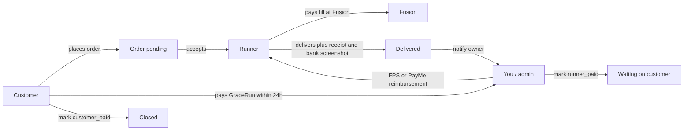
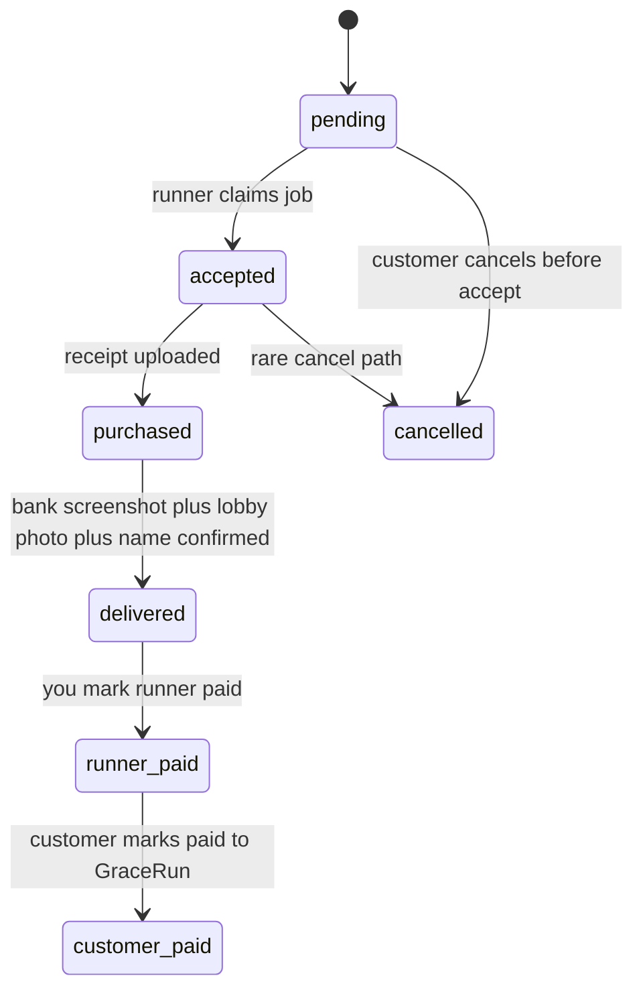
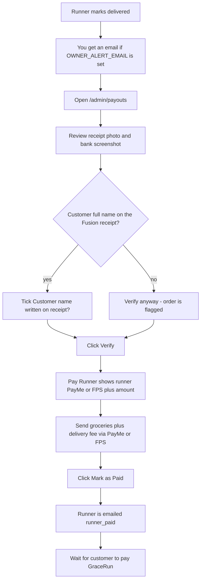
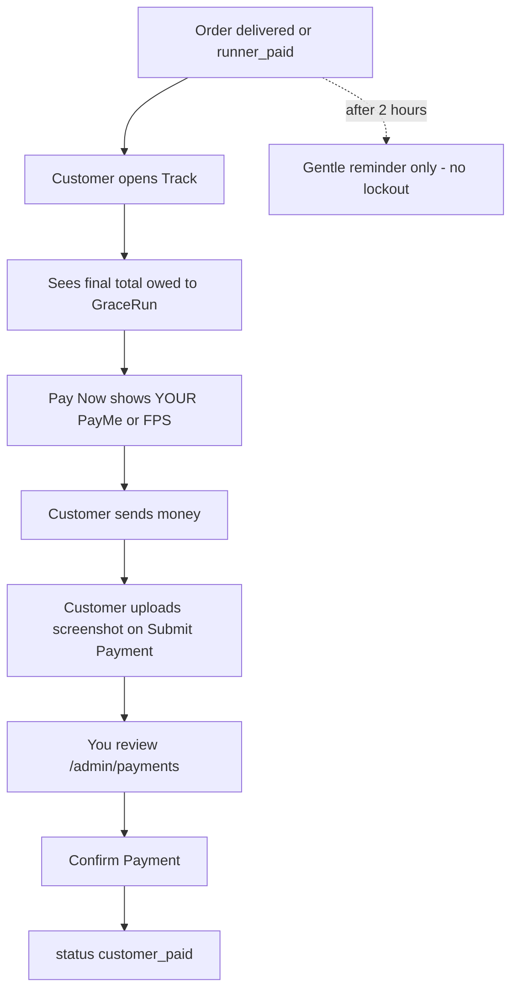
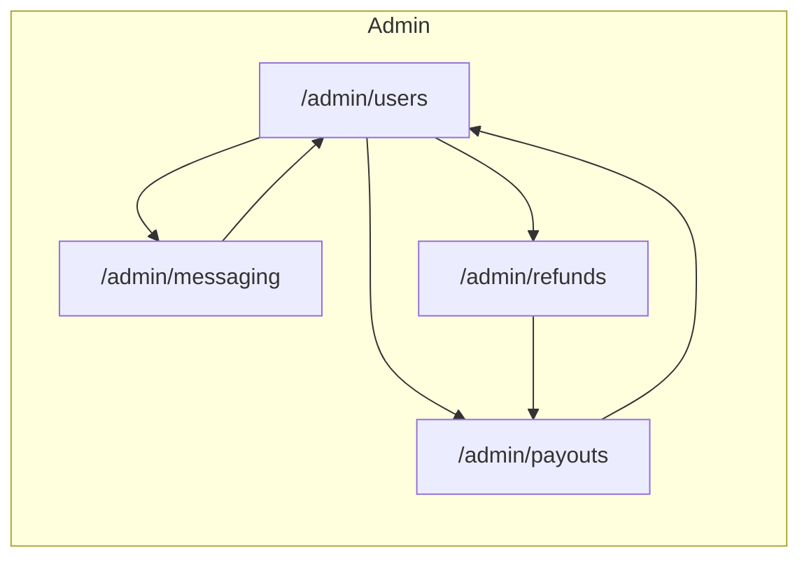

# GraceRun admin system

How money, verification, and admin pages work. You (the owner) sit in the middle: the runner fronts Fusion, you reimburse the runner, then the customer pays GraceRun.

Admin pages (your account must exist in Firestore `/admins/{uid}`):

| Page | URL |
| --- | --- |
| Verify & pay runners | [/admin/payouts](https://gracerun.fit/admin/payouts) |
| Users | [/admin/users](https://gracerun.fit/admin/users) |
| Messaging | [/admin/messaging](https://gracerun.fit/admin/messaging) |
| Payment submissions | [/admin/payments](https://gracerun.fit/admin/payments) |
| Fusion price refunds | [/admin/refunds](https://gracerun.fit/admin/refunds) |

---

## End-to-end money flow



You never need the customer to pay the runner. The runner is made whole by you as soon as you verify the delivery.

---

## Order statuses



| Status | Who acts | What it means on the payout page |
| --- | --- | --- |
| `pending` | Customer / waiting | Not on the payout list |
| `accepted` | Runner heading to Fusion | Not on the payout list |
| `purchased` | Runner paid at Fusion | Not on the payout list |
| `delivered` | **You** | Shown as `pending_payout` |
| `runner_paid` | Customer | Shown as `runner_paid` |
| `customer_paid` | Done | Shown as `customer_paid` |
| `cancelled` | — | Not paid out |

Legacy Firestore values still map: `assigned` → `accepted`, `picked` → `purchased`, `completed` → `runner_paid`, `paid` → `customer_paid`.

---

## Your job after delivery



**Amount to send the runner** = Fusion receipt total (`amountPaidByRunner`) + delivery fee.

**What the customer owes you** = same grocery total + delivery fee + any tip.

### Verify checklist

1. Receipt photo exists and matches the claimed spend.
2. Bank / FPS screenshot exists.
3. Customer’s **full name** is written on the receipt (mandatory rule).
4. Tick **Customer name written on receipt?** if it is.
5. **Verify** — sets `adminVerified`. If the name box is unchecked, the card is flagged amber.
6. **Pay Runner** — scroll to their PayMe/FPS ID and the pre-filled total.
7. **Mark as Paid** — only enabled after Verify. Writes `runner_paid` + `runnerPaidAt`.

---

## Customer repayment (you collect)



Customers agree in the terms to pay within **24 hours**. The app only nudges after 2 hours; it does not cancel the order.

Your PayMe/FPS shown to customers comes from Vercel env:

- `NEXT_PUBLIC_OWNER_PAYMENT_METHOD` — `PayMe` or `FPS`
- `NEXT_PUBLIC_OWNER_PAYME_ID` — the number / ID they should send to

---

## Admin pages



- **Users** — roster (name, email, college/hall, runner flag, CUHK verified). **Message** opens a 1:1 chat stored in `/messages`. Replies show an unread badge. Sending can also email them from `hello@gracerun.fit`.
- **Payment submissions** — customer PayMe/FPS screenshots. **Confirm Payment** sets the order to `customer_paid`.
- **Messaging** — email New Users (last 7 days), Runners (`isRunner`), or Long-Term Users (registered &gt; 30 days). Sends individually via Resend from `GraceRun <hello@gracerun.fit>` with reply-to `andrew.ribli@gmail.com`. Requires a Firebase ID token + `/admins/{uid}`. Use **Send test to myself** before blasting.
- **Payouts** — every order in `delivered` / `runner_paid` / `customer_paid`. This is the daily ops screen.
- **Refunds** — leftover path for old “Fusion till cheaper than estimate” cases (`priceAdjustmentStatus == refund_pending`). Rare under the new runner-fronts-Fusion model.

Access: Firestore `/admins/{yourAuthUid}` must exist. `RequireAdmin` gates every admin route.

---

## Notifications

```mermaid
flowchart LR
  placed[Customer places order] --> adminOps[1155233599@link.cuhk.edu.hk]
  placed --> runners[RUNNER_ALERT_EMAIL]
  signup[New user registers] --> adminOps
  delivered[Runner marks delivered] --> owner[OWNER_ALERT_EMAIL or RUNNER_ALERT_EMAIL]
  runnerPaid[You mark runner paid] --> runnerInbox[order.runnerEmail]
  customerPaid[Customer marks paid] --> customerInbox[order.customerEmail]
```

| Event | Who is emailed |
| --- | --- |
| New order | `1155233599@link.cuhk.edu.hk` (admin ops) plus `RUNNER_ALERT_EMAIL` / runner roster |
| New signup | `1155233599@link.cuhk.edu.hk` |
| Delivered | `OWNER_ALERT_EMAIL`, falling back to `RUNNER_ALERT_EMAIL` |
| You marked runner paid | Runner email stored on the order at accept |
| Customer marked paid | Customer email on the order |

---

## Fields you care about on `orders`

| Field | Role |
| --- | --- |
| `status` | Lifecycle above |
| `receiptUrl` | Fusion receipt photo |
| `bankStatementUrl` | Bank / FPS screenshot |
| `amountPaidByRunner` / `finalTotal` | Grocery spend to reimburse |
| `deliveryFee` | Extra amount you send the runner / charge the customer |
| `customerNameOnReceipt` | Your Verify checkbox |
| `adminVerified` | You clicked Verify |
| `runnerVerified` | Runner confirmed they wrote the name |
| `runnerPaymentMethod` / `runnerPaymentId` | Where you send money |
| `runnerPaidAt` | When you reimbursed |
| `customerPaidAt` | When the customer said they paid you |

---

## Env vars to set on Vercel

```
OWNER_ALERT_EMAIL=you@example.com
NEXT_PUBLIC_OWNER_PAYMENT_METHOD=PayMe
NEXT_PUBLIC_OWNER_PAYME_ID=your-payme-id
RUNNER_ALERT_EMAIL=optional-runner-broadcast@example.com
```

Redeploy after changing `NEXT_PUBLIC_*` values so the customer Pay Now screen picks them up.
